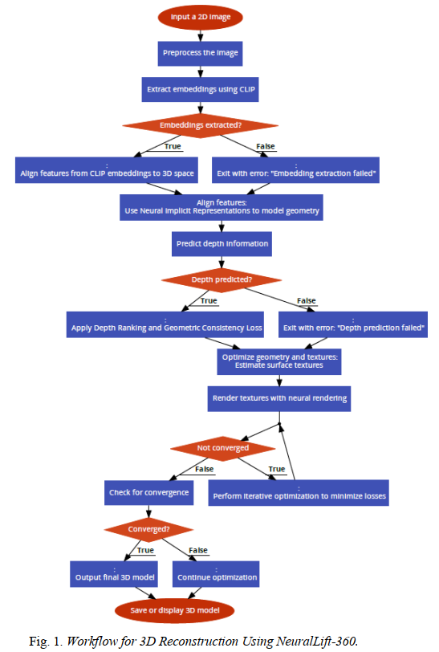

---

# **NeuralLift-360: Single-Image 3D Reconstruction**

### **A Forked and Extended Implementation of NeuralLift-360**

---

## **Table of Contents**
1. [Introduction](#introduction)
2. [Core Features](#core-features)
3. [Team Members and Contributions](#team-members-and-contributions)
4. [Workflow](#workflow)
5. [Installation](#installation)
6. [Usage Guide](#usage-guide)
7. [Experimental Results](#experimental-results)
8. [Visual Outputs](#visual-outputs)
9. [Optimized Hyperparameters](#optimized-hyperparameters)
10. [Google Colab Links](#google-colab-links)
11. [Acknowledgments and References](#acknowledgments-and-references)

---

## **Introduction**

NeuralLift-360 is a state-of-the-art neural rendering framework designed to generate photorealistic 3D objects from single 2D images. By integrating advanced methodologies like CLIP embeddings and Neural Radiance Fields (NeRF), the framework reconstructs unseen textures and geometry with exceptional accuracy. 

This repository extends the original implementation with significant optimizations for hardware constraints, systematic hyperparameter tuning, and performance analysis.

---

## **Core Features**
- **Photorealistic Textures**: Reconstructs textures with high fidelity using CLIP-guided models.
- **Geometry Consistency**: Maintains 3D object structural coherence across all angles.
- **Efficiency**: Adapted for Google Colab and T4 GPUs (15GB VRAM).
- **Customizability**: Parameter tuning for batch size, resolution, and training stability.

---

## **Team Members and Contributions**


| Name              | GitHub Username                                | Contribution                                                                                   |
|-------------------|------------------------------------------------|-----------------------------------------------------------------------------------------------|
| **Rohan Sharma**  | [@ToxicCoder02](https://github.com/ToxicCoder02) | Project Lead: Compatibility Testing, Hyperparameter Tuning, Code Optimization for Colab, and Result Validation. |
| **Shailesh Chaudhary** | [@Sschaudhary6](#)                            | Documentation, Batch Testing.                                                                 |

To verify individual contributions, refer to the `git log` in the repository.

---

## **Workflow**

The following diagram illustrates the complete pipeline for generating 3D reconstructions from a single 2D image using NeuralLift-360:



---

## **Installation**

Clone the repository and install dependencies:
```bash
git clone https://github.com/ToxicCoder02/ML-Project.git
cd ML-Project
pip install -r requirements.txt
```

---

## **Usage Guide**

1. **Prepare Input**: Place your 2D image in the `inputs/` folder.
2. **Run the Pipeline**:
   ```bash
   python main.py --input inputs/sample.jpg --output outputs/
   ```
3. **Adjust Parameters**: Edit `config.yaml` for batch size, resolution, and CLIP weights.
4. **Output Files**: Results will be saved in the `outputs/` directory.

---

## **Experimental Results**

---

## **Experimental Results**

### **CLIP Weight: Observations and Analysis**

| CLIP Weight | GPU VRAM Usage | Training Time | Final Loss | Output Quality                                                                                     |
|-------------|-----------------|---------------|------------|---------------------------------------------------------------------------------------------------|
| 1           | ~9 GB           | ~20 minutes   | 0.2543     | Poor alignment: Textures lacked clarity, geometry was overly simplified, and output diverged.    |
| **10**      | **~11 GB**      | **~22 minutes** | **0.2113** | **Balanced alignment**: Textures were sharper, geometry was stable, closely resembling input.    |
| 20          | ~13 GB          | ~22.5 minutes | 0.2198     | Over-sharpening: Textures became overly detailed, leading to artifacts, and geometry inconsistencies. |

---

### **Batch Size: Observations and Analysis**

| Batch Size | GPU VRAM Usage | Training Time | Final Loss | Output Quality                                                                                     |
|------------|-----------------|---------------|------------|---------------------------------------------------------------------------------------------------|
| 128        | ~8 GB           | ~18 minutes   | 0.2289     | Moderate texture clarity; geometry slightly inconsistent.                                        |
| **256**    | **~11 GB**      | **~20 minutes** | **0.2113** | **Sharp textures**; stable geometry with minimal artifacts.                                      |
| 512        | ~14 GB          | ~24 minutes   | 0.2034     | Slight overfitting observed; geometry became overly detailed.                                    |

---

### **Resolution: Observations and Analysis**

| Resolution  | GPU VRAM Usage | Training Time | Final Loss | Output Quality                                                                                     |
|-------------|-----------------|---------------|------------|---------------------------------------------------------------------------------------------------|
| 64×64       | ~6 GB           | ~15 minutes   | 0.2634     | Low-resolution outputs; textures were blurry, geometry was overly simplified.                   |
| **128×128** | **~11 GB**      | **~20 minutes** | **0.2113** | **Balanced quality**: Textures were sharp, geometry was consistent.                             |
| 256×256     | ~18 GB          | ~35 minutes   | 0.1987     | Excellent texture clarity but required significantly more resources and time.                   |

---

### **Training Efficiency**

#### **CLIP Weight Observations**
| CLIP Weight | GPU VRAM Usage | Training Time | Final Loss | Output Quality                                                                                     |
|-------------|-----------------|---------------|------------|---------------------------------------------------------------------------------------------------|
| 1           | ~9 GB           | ~20 minutes   | 0.2543     | Poor alignment: Textures lacked clarity, geometry was overly simplified, and output diverged.    |
| **10**      | **~11 GB**      | **~22 minutes** | **0.2113** | **Balanced alignment**: Textures were sharper, geometry was stable, closely resembling input.    |
| 20          | ~13 GB          | ~22.5 minutes | 0.2198     | Over-sharpening: Textures became overly detailed, leading to artifacts, and geometry inconsistencies. |

#### **Optimized Parameters**
| Parameter            | Value             |
|----------------------|-------------------|
| Batch Size           | 256               |
| Training Resolution  | 128×128           |
| Rendering Resolution | 200×200           |
| CLIP Guidance Weight | 10                |
| Timestep Annealing   | Exponential Decay |
| Iterations           | 6000              |

---

## **Visual Outputs**

### **Comparative Outputs with Resolutions**

| Training Resolution | RGB Output                                      | Depth Output                                      |
|----------------------|------------------------------------------------|--------------------------------------------------|
| 32×32               | [RGB Output (32×32)](/images/lift_ep0010_rgb%20(2)_32.mp4) | [Depth Output (32×32)](/images/lift_ep0010_depth%20(2)_32.mp4) |
| 128×128             | [RGB Output (128×128)](/images/lift_ep0010_rgb%20(2)_128.mp4) | [Depth Output (128×128)](/images/lift_ep0010_depth%20(2)_128.mp4) |
| 256×256             | [RGB Output (256×256)](/images/lift_ep0010_rgb%20(2)_256.mp4) | [Depth Output (256×256)](/images/lift_ep0010_depth%20(2)_256.mp4) |
| 512×512             | [RGB Output (512×512)](/images/lift_ep0010_rgb%20(1)_512.mp4) | [Depth Output (512×512)](/images/lift_ep0010_depth%20(1)_512.mp4) |
| 2048×2048           | [RGB Output (2048×2048)](/images/lift_ep0010_rgb%20(1)_2048.mp4) | [Depth Output (2048×2048)](/images/lift_ep0010_depth%20(1)_2048.mp4) |

---

These links will allow users to download or play the videos directly (if supported by the platform). Let me know if you'd like additional formatting or other video-specific details added!
#### **Single Image to RGB 360° View**
- Input Image:
  

- Reconstructed RGB 360° View:
  [RGB Output (2048×2048)](images/lift_ep0020_rgb.mp4)

- Depth 360° View:
  [Depth Output (2048×2048)](images/lift_ep0020_depth.mp4)

---

## **Google Colab Links**

Here are some pre-configured notebooks for quick experimentation:
1. [Quick Start with Default Parameters](https://colab.research.google.com/drive/1XOeBMM1XTd5MWy1ay2tU1QVk8WNz3RQo)
2. [Advanced Reconstruction](https://colab.research.google.com/drive/1qE2Dwwxs7RbZmfuufZqfe_NyfRP_ri4P)
3. [Boostmonoculardepth_npy](https://colab.research.google.com/drive/15YCsqaO6l94HueVwPQgHqVVDUJzdOEO5)
4. [stable-dreamfusion](https://colab.research.google.com/drive/1ncs4m7Of2ltE-EpwqBiCZzbYUp1V2yNL)
---

-*Note:- All huper parameter tuning was done by just changing the parameneters in Cabin.yaml dynamically and was re-ran after each and all results are available in /images for refernce

---

## **Acknowledgments and References**

### **Acknowledgments**
- Original framework by [VITA-Group](https://github.com/VITA-Group/NeuralLift-360).
- GPU resources and development environment provided by Google Colab.

### **References**
1. [NeuralLift-360: GitHub Repository](https://github.com/VITA-Group/NeuralLift-360)
2. [CLIP: Learning Transferable Visual Models From Natural Language Supervision](https://arxiv.org/abs/2103.00020)
3. [NeRF: Neural Radiance Fields](https://arxiv.org/abs/2003.08934)
4. [NVIDIA T4 GPU Architecture](https://www.nvidia.com/en-us/data-center/tesla-t4/)

---
